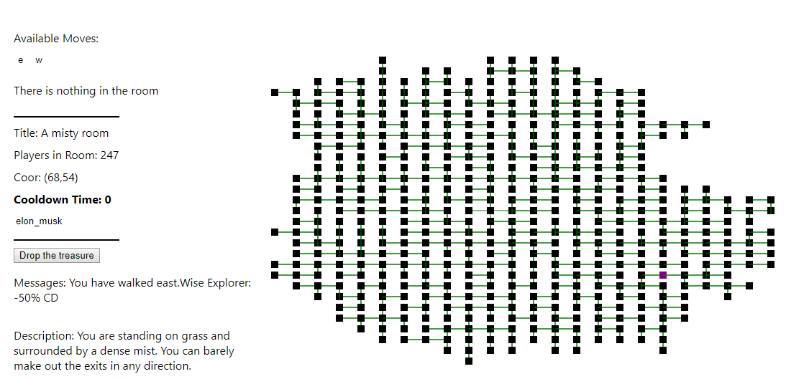

 

 Aside from coding, I spend a night thinking about play a game that can walk around the a mystery room.
 After realizing there is no good way to build a game like this. I went away to build one of my own.
 This little game may seen boring, but if we walk around the room, there are so many thing we can find.
 
 It uses React on the front-end and a Django REST-API on the back-end.